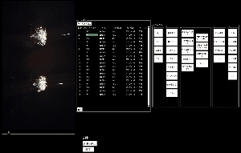
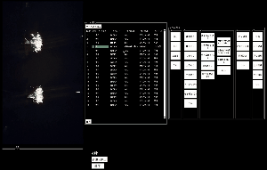
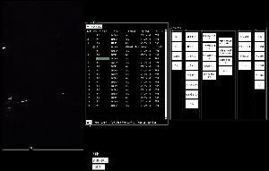

# Annotation App
## Getting Started
Windowsでの使用を想定しています．
### インストール
```
$ pip install -r requirements.txt
$ python movie_opencv_simple.py
```

### 使用方法

**基本的な操作の流れ**


1. アノテーション作業をする動画を選択
2. 動画を再生しラベルを選択  
動画が読み込まれたらラベル選択部分のボタンを押してアノテーション作業を進めてください．  
  
4. ラベルをテキストファイルに出力

一度アノテーション作業した動画をもう一度作業したい場合は「ラベル読み込み」ボタンからファイルを選択して、手順2から作業してください．

***

**ショートカットキー**
- Ctrl + c：現在再生位置のラベルをコピー  
  
- Ctrl + v：コピーされたラベルを現在再生位置にペースト  
  
- g：現在再生位置のラベルXの部分を「溝蓋の上」にする
- k：再生/停止
- j：一秒前に戻る
- l：一秒先に進む

### その他注意事項
- 再生しながら再生位置の変更(ショートカットキーのj,l等)をすると現在再生位置が複数個になってしまう事があるので、再生位置を変更する際は動画を一時停止して下さい．
- ほとんど発生しませんが原因不明のバグがあり、異常終了してしまうことがあります．
